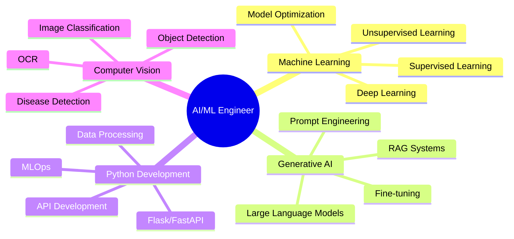

<div align="center">

<!-- Animated Header Banner -->


<!-- Dynamic Typing Animation -->


<br/>
<br/>
<br/>


<!-- Profile Views Counter & Social Badges -->
<p>
  
  <a href="https://www.linkedin.com/in/bharat-dhande-b6108625a/">
    
  </a>
  <a href="mailto:bdhande45@gmail.com">
    
  </a>
  
</p>

</div>

---

## 🚀 About Me

```python
class AIMLEngineer:
    def __init__(self):
        self.name = "Bharat Dhande"
        self.role = "AI/ML Engineer & Python Developer"
        self.education = "B.E. Computer Science @ Saraswati College of Engineering"
        self.location = "India 🇮🇳"
        self.contact = "bdhande45@gmail.com"
        
    def get_expertise(self):
        return {
            "ai_ml": {
                "core": ["Machine Learning", "Deep Learning", "NLP", "Computer Vision"],
                "generative_ai": ["LLMs", "RAG Systems", "Prompt Engineering"],
                "frameworks": ["TensorFlow", "PyTorch", "Scikit-learn", "Keras"],
                "nlp_tools": ["LangChain", "Hugging Face", "Transformers", "FAISS"]
            },
            "python_development": {
                "core": ["Python 3.x", "OOP", "Design Patterns", "Data Structures"],
                "web": ["Flask", "FastAPI", "Django", "REST APIs"],
                "data": ["Pandas", "NumPy", "Matplotlib", "Seaborn", "Plotly"],
                "databases": ["MySQL", "MongoDB", "Vector DBs", "PostgreSQL"]
            },
            "mlops": ["Model Deployment", "Docker", "Git", "CI/CD", "AWS/GCP"],
            "additional": ["Java", "Spring Boot", "React", "Angular"]
        }
    
    def current_focus(self):
        return [
            "🌾 Building Smart Farm - AI-powered agricultural intelligence",
            "🤖 Developing advanced RAG systems with LangChain",
            "📊 Creating predictive models for real-world applications",
            "🔬 Exploring cutting-edge LLM architectures & fine-tuning"
        ]

engineer = AIMLEngineer()
print(f"👋 Hi! I'm {engineer.name}, transforming ideas into intelligent solutions!")
```

---

## 💼 Core Tech Stack

<div align="center">

### 🤖 AI/ML & Deep Learning


### 🦜 NLP & LLMs


### 📊 Data Science & Analytics


### 🌐 Python Web Development


### 🗄️ Databases & Cloud


### ⚡ Additional Skills


</div>

---

## 🎯 Featured AI/ML Projects

<div align="center">

<table>
<tr>
<td width="50%" valign="top">

### 🌾 Smart Farm
**AI-Powered Agricultural Intelligence System**

[](https://github.com/BharatDhande/Smart_Farm)

**🔧 Tech Stack:**
- 🐍 Python | Flask
- 🤖 ML Models (Scikit-learn)
- 📊 Data Analytics
- 🎨 Web Dashboard

**✨ Key Features:**
- 🌱 Smart Crop Recommendation Engine
- 💊 Fertilizer Optimization Algorithm
- 🔬 Plant Disease Detection (Computer Vision)
- 💰 Real-time Market Price Scraper
- 📈 Yield Prediction Models

**🎓 Learning Outcomes:**
- End-to-end ML pipeline development
- Model deployment & productionization
- Real-world agricultural data analysis

</td>
<td width="50%" valign="top">

### 🤖 RAGify
**Production-Ready RAG Chatbot**

[](https://github.com/BharatDhande/RAGify)

**🔧 Tech Stack:**
- 🦜 LangChain Framework
- 🤖 Google Generative AI
- 🔍 FAISS Vector Store
- ⚡ Flask Backend
- 🎭 Gradio UI

**✨ Key Features:**
- 📚 Context-Aware Response Generation
- 🔎 Semantic Search with Vector Embeddings
- 🏗️ Modular LLM Pipeline Architecture
- 🌐 Web Content Indexing & Retrieval
- 🎯 Real-time Query Processing

**🎓 Learning Outcomes:**
- Advanced RAG architecture implementation
- Vector database optimization
- LLM prompt engineering

</td>
</tr>

<tr>
<td width="50%" valign="top">

### 📊 Big Mart Sales Prediction
**ML-Powered Retail Analytics**

[](https://github.com/BharatDhande/Big-Mart)

**🔧 Tech Stack:**
- 🐍 Python | Pandas | NumPy
- 📈 Scikit-learn (Regression Models)
- 📊 Matplotlib | Seaborn
- 🔍 Feature Engineering

**✨ Key Features:**
- 📉 Historical Sales Pattern Analysis
- 🎯 Multiple Regression Models
- 📊 Advanced Feature Engineering
- 🔍 Model Performance Optimization
- 📈 Visualization & Insights

**🎓 Learning Outcomes:**
- Data preprocessing & cleaning
- Feature engineering techniques
- Model evaluation & selection

</td>
<td width="50%" valign="top">

### 🏦 FinEdge
**Secure Banking Portal with Full Stack**

[](https://github.com/BharatDhande/RAGify)

**🔧 Tech Stack:**
- ☕ Spring Boot | Spring Security
- 🅰️ Angular Frontend
- 🔐 JWT Authentication
- 🗄️ MySQL Database
- 🔌 RESTful APIs

**✨ Key Features:**
- 👤 Secure User Management System
- 💳 PIN-Based Authentication
- 💸 Real-time Fund Transfer
- 📜 Transaction History Tracking
- 🛡️ Role-Based Access Control

**🎓 Learning Outcomes:**
- Backend API development
- Security implementation
- Full-stack integration

</td>
</tr>
</table>

### 🛠️ More Projects

<details>
<summary><b>🛒 Cartify - E-Commerce Platform</b></summary>
<br/>

[](https://github.com/BharatDhande/Cartify)

**Tech:** Java | Spring Boot | MySQL | REST API  
**Features:** User Auth, Admin Panel, Product & Order Management
</details>

<details>
<summary><b>🎓 Student Management System</b></summary>
<br/>

[](https://github.com/BharatDhande/Student-management-system)

**Tech:** Java | JDBC | Swing | MySQL  
**Features:** Records Management, Attendance, Marks, Database Operations
</details>

</div>

---

## 📊 GitHub Analytics

<div align="center">

<!-- GitHub Stats Cards -->


<br/><br/>

<!-- GitHub Streak Stats -->


<br/><br/>

<!-- Activity Graph -->


<br/>

<!-- Trophy Stats -->


</div>

---

## 🎯 Current Focus Areas

<div align="center">



</div>

---

## 🌟 Skills Matrix

<div align="center">

| 🤖 AI/ML Expertise | 🐍 Python Development | 🛠️ Tools & Platforms |
|:------------------:|:---------------------:|:---------------------:|
| Machine Learning ⭐⭐⭐⭐⭐ | Python 3.x ⭐⭐⭐⭐⭐ | Git & GitHub ⭐⭐⭐⭐⭐ |
| Deep Learning ⭐⭐⭐⭐ | Flask/FastAPI ⭐⭐⭐⭐⭐ | Docker ⭐⭐⭐⭐ |
| NLP & LLMs ⭐⭐⭐⭐⭐ | Data Analysis ⭐⭐⭐⭐⭐ | Linux/Unix ⭐⭐⭐⭐ |
| Computer Vision ⭐⭐⭐⭐ | REST APIs ⭐⭐⭐⭐⭐ | AWS/GCP ⭐⭐⭐ |
| RAG Systems ⭐⭐⭐⭐⭐ | Database Design ⭐⭐⭐⭐ | CI/CD ⭐⭐⭐⭐ |
| Model Deployment ⭐⭐⭐⭐ | OOP & Design Patterns ⭐⭐⭐⭐ | Jupyter Notebook ⭐⭐⭐⭐⭐ |

</div>

---

## 📈 Contribution Heatmap

<div align="center">


<br/><br/>


</div>

---

## 🎓 Continuous Learning Journey

```python
learning_path = {
    "currently_mastering": [
        "Advanced LLM Fine-tuning Techniques",
        "Production MLOps Best Practices",
        "Scalable Vector Database Architecture",
        "Multi-Agent AI Systems"
    ],
    "recent_achievements": [
        "✅ Built production-ready RAG system with LangChain",
        "✅ Deployed end-to-end ML pipeline for Smart Farm",
        "✅ Implemented semantic search with FAISS",
        "✅ Created predictive models for retail analytics"
    ],
    "next_goals": [
        "🎯 Contribute to major open-source ML projects",
        "🎯 Deploy models on cloud platforms (AWS/GCP)",
        "🎯 Explore reinforcement learning applications",
        "🎯 Build real-time streaming ML pipelines"
    ]
}
```

---

## 💼 Open to Opportunities

<div align="center">

### 🚀 Actively Seeking AI/ML Engineer & Python Developer Roles

I'm passionate about building intelligent systems that solve real-world problems. With expertise in **Machine Learning**, **LLMs**, **RAG systems**, and **Python development**, I'm ready to contribute to innovative projects and drive AI transformation.

**What I Bring:**
- 💡 Strong foundation in AI/ML algorithms and deep learning
- 🐍 Advanced Python programming and software development
- 🤖 Hands-on experience with LangChain, FAISS, and generative AI
- 📊 Data-driven decision making and analytical mindset
- 🚀 End-to-end project delivery from concept to deployment

**Interested in:**
- AI/ML Engineering positions
- Python Developer roles with ML focus
- Research & Development in NLP/Computer Vision
- Generative AI and LLM applications
- Full-time opportunities or interesting freelance projects

</div>

---

## 🤝 Let's Connect!

<div align="center">

[](https://www.linkedin.com/in/bharat-dhande-b6108625a/)
[](mailto:bdhande45@gmail.com)
[](https://github.com/BharatDhande)
[](https://bharatdhande.github.io/me/)

<br/>

### 📬 Get In Touch

Feel free to reach out for:
- 💼 Job Opportunities
- 🤝 Collaboration on AI/ML Projects
- 💡 Technical Discussions
- 🎓 Mentorship or Knowledge Sharing

**📧 Email:** bdhande45@gmail.com  
**📍 Location:** India  
**💼 Status:** Open to Work

<br/>

### ⚡ Fun Fact About Me

```python
def passion_equation():
    return ("AI/ML" + "Python" + "Problem Solving") * "Continuous Learning"

result = passion_equation()
print(f"My passion: {result}")
# Output: Building intelligent solutions that make a real impact! 🚀
```

</div>

---

<div align="center">


**✨ "Transforming complex problems into elegant AI solutions, one algorithm at a time" ✨**

**⭐ If you find my work interesting, consider giving a star to my repositories! ⭐**

<br/>


</div>
